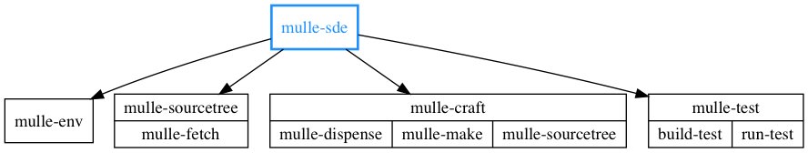
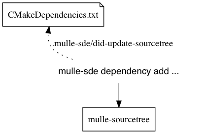
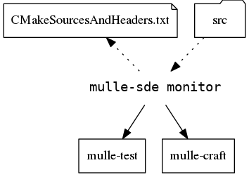

🏋🏼 Cross-platform IDE for the C language family

... for Linux, OS X, FreeBSD, Windows

**mulle-sde** is a commandline based software development environment. The idea is to organize your project with the filesystem, and then let **mulle-sde** reflect the changed filesystem back to the "Makefile".

* creates projects
* builds your project via **mulle-craft**
* tests your project via **mulle-test**
* adds and removes dependencies via **mulle-sourcetree** (+ cmake support)
* monitors filesystem changes and updates your project files (+ cmake support)




Executable      | Description
----------------|--------------------------------
`mulle-sde`     | Create projects, add and remove dependencies, monitor filesystem and rebuild and test on demand


## Create a **mulle-sde** "hello world" project

A **mulle-sde** project is a (currently) a **cmake** project. Since the
various tools are configured with environment variables, it creates  a virtual environment using **mulle-env**, so that various projects
can coexist.

Create a tool cmake project for C:

```
$ mulle-sde init -d hello executable
```

Enter the environment:

```
$ mulle-sde hello
```

Build it:

```
$ mulle-sde build
```

Run it:

```
$ ./build/hello
```

Leave the environment:

```
$ exit
```

## mulle-sde dependencies



## mulle-sde extensions

Extensions are the build systems supported by mulle-sde.

## mulle-sde libraries

Libraries are OS provide libraries (like libm.a) that you don't want to build yourself as a dependency.

## mulle-sde tools

Tools are the commandline tools available in the virtual environment. 
You can add or remove tools with this command set.

## mulle-sde update

Reflect changes in the filesystem back into the 'Makefiles'



## mulle-sde monitor

The monitor waits on changes to the filesystem and then calls update to rebuild and retest your project.


