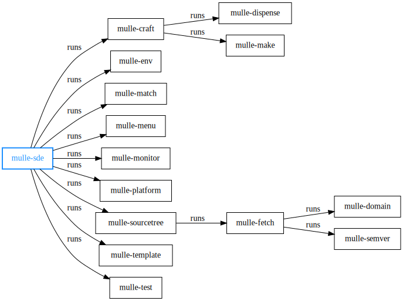

# 💠 Cross-platform IDE for the command-line

... for Android, BSDs, Linux, macOS, SunOS, Windows (MinGW, WSL)

MulleSDE is an IDE and a dependency (package) manager for the commandline.
You could call it a [npm](https://www.npmjs.com/) or a [virtualenv](//pypi.org/project/virtualenv)
for C languages. Currently C and Objective-C are supported. C++ is very
likely to work too.


The basic principle in mulle-sde is the **Edit - Reflect - Craft** cycle.

**Edit** - `mulle-sde edit` sets up the editor of your choice. Use it or any Desktop GUI
or the terminal to manage the project files.<br>
**Reflect** - Changes in the filesystem are picked up by `mulle-sde reflect` and are used
to update build system files and header files.<br>
**Craft** - `mulle-sde craft` fetches dependencies, builds them and installs them local to
your project. Then it will build your project.


## Example

Here is run through of the major commands to get you going with an Objective-C
project:

### Initialize a project

Choose `executable` and `foundation/objc-developer` at the prompts:

```sh
mkdir myproject
cd myproject
mulle-sde init
```

or

```sh
mulle-sde init -d myproject -m foundation/objc-developer executable
cd myproject
```

### Look at project

``` sh
tree .               # or ls -R if tree is not installed
mulle-sde file
mulle-sde view
mulle-sde dependency
mulle-sde library
```

### Develop project

Choose the editor of your choice. For a better demo effect, choose one of the
IDEs.

``` sh
mulle-sde edit
```

You don't have to use `mulle-sde edit` though, it's a mere convenience.


``` sh
mulle-sde definition set CFLAGS "-DFOO=1"
mulle-sde craft
mulle-sde log
mulle-sde product
mulle-sde run
mulle-sde debug
mulle-sde add src/MyClass.m
mulle-sde ignore src/MyClass.m src/MyClass.h
mulle-sde reflect
mulle-sde clean
mulle-sde clean all
mulle-sde clean tidy
```


### Add a third party dependency

``` sh
mulle-sde add github:madler/zlib.tar
mulle-sde dependency move zlib to top
mulle-sde dependency list
mulle-sde craftinfo zlib CFLAGS "-DBAR=1"
mulle-sde craft
mulle-sde dependency headers
mulle-sde dependency libraries
```

`mulle-sde clean tidy` and the somewhat less safe `mulle-sde clean gravetidy`
will become important, when doing lots of dependency manipulations.


### Test project

``` sh
mulle-sde test init
mulle-sde test craft
mulle-sde test run
mulle-sde test coverage
```


### Going a little deeper

``` sh
mulle-sde -vv craft
mulle-sde craftorder
mulle-sde craftstatus
mulle-sde environment
mulle-sde patternfile --cat
mulle-sde style
mulle-sde tool
```

### Going deep

``` sh
mulle-sde callback
mulle-sde config
mulle-sde donefile
mulle-sde headerorder
mulle-sde linkorder
mulle-sde task
mulle-sde -ld -ls -lx treestatus
```


## Usage

Outside of a mulle-sde project, you have these commands to initialize a new
project or to create non-project files:

```
Usage:
   mulle-sde [flags] [command] [options]

   The commandline IDE with the development cycle Edit -> Reflect -> Craft.

   * Edit     you use your preferred editors and file managers
   * Reflect  mulle-sde creates the necessary make files
   * Craft    mulle-sde builds the dependencies and the project

   Start a project with `mulle-sde init` or enter an existing mulle-sde
   project with `mulle-sde <directory>`. Download and craft dependencies
   or embed remote sources with `mulle-sde add`. Get more help with
   `mulle-sde init help` or  `mulle-sde add help`.

   See the Wiki for more information:
      https://github.com/mulle-sde/mulle-sde/wiki

Flags:
   --style <val>  : see `mulle-env help` for style description
   -DKEY=VALUE    : define one-time environment variable
   -ld            : additional debug output
   -le            : additional environment debug output
   -lt            : trace through bash code
   -lx            : external command execution log output
   -n             : dry run
   -s             : be silent
   -v             : be verbose (increase with -vv, -vvv)

Commands:
   add            : create a source file from templates
   commands       : list of all available commands (some undocumented)
   extension      : manage language and buildtool extensions
   init           : create a new project
   init-and-enter : create a new project then immediately start a subshell
   install        : install a remote mulle-sde project, like make install
   libexec-dir    : print path to mulle-sde libexec
   show           : show available meta extensions
   uname          : the simplified uname(1)

   Options are command specific. Use mulle-sde <command> -h for help.
```
Once a project has been created, you will have a virtual environment with
a whole lot more commands at your disposal:

```
Usage:
   mulle-sde [flags] [command] [options]

   The commandline IDE with the development cycle Edit -> Reflect -> Craft.

   * Edit     you use your preferred editors and file managers
   * Reflect  mulle-sde creates the necessary make files
   * Craft    mulle-sde builds the dependencies and the project

   Edit source files in 'src'. If you add, delete, rename or move
   source files run `mulle-sde reflect`. Use `mulle-sde craft` to craft your
   project. Add system libraries with `mulle-sde library` and other
   dependencies with `mulle-sde dependency`.

   See the Wiki for more information:
      https://github.com/mulle-sde/mulle-sde/wiki

Flags:
   -DKEY=VALUE    : define one-time environment variable
   -ld            : additional debug output
   -le            : additional environment debug output
   -lt            : trace through bash code
   -lx            : external command execution log output
   -n             : dry run
   -s             : be silent
   -v             : be verbose (increase with -vv, -vvv)

Commands:
   add            : create a source file from templates
   callback       : manage reflection callbacks
   cd             : change directory to dependency,kitchen et al.
   clean          : clean various parts of the project
   commands       : list of all available commands (some undocumented)
   config         : show multiple sourcetree configurations
   craft          : craft the project using mulle-craft
   craftinfo      : show build flags of dependencies
   craftorder     : show craftorder of dependencies
   craftstatus    : show the craft status of the dependencies
   crun           : craft and run if project is an executable
   definition     : change projects craft options like CFLAGS
   dependency     : manage third party components (like GitHub projects)
   donefile       : show contents of donefiles
   env-identifier : get variable name MULLE_UIOS for a name like MulleUIOS
   environment    : manage environment variables (project settings)
   exec           : run a command in a subshell
   export         : export a dependency or library as mulle-sde commands
   extension      : manage language and buildtool extensions
   fetch          : fetch the sourcetree
   headerorder    : show header includes for dependencies and libraries
   ignore         : block files from being crafted
   init           : create a new project
   json           : show dependencies and libraries as JSON
   library        : manage second party (OS) libraries (like pthread)
   linkorder      : show linkorder of dependencies and libraries
   list           : list project files (files matching patternfiles)
   log            : show craft results
   match          : experiment with patternfiles
   monitor        : monitor project files, run reflect and craft
   patternfile    : manage patternfiles
   product        : location of main executable or library, heuristic
   project        : rename a project and its files
   project-dir    : print project root directory
   reflect        : update project makefiles and sources
   retest         : retest using mulle-test
   run            : run executable product
   searchpath     : show search path for build products
   source-dir     : print project source directory
   status         : show information about the current project state
   subproject     : manage local subprojects
   task           : manage reflection tasks
   test           : run tests using mulle-test
   treestatus     : show the sourcetree status
   unveil         : produce sandbox CSV
   view           : give an overview over the project settings

   Options are command specific. Use mulle-sde <command> -h for help.
```


## Info

[De Re mulle-sde](https://www.mulle-kybernetik.com/de-re-mulle-sde/) is a
short introductory guide. It's a quick read, and gives a good overview.

MulleSDE strives to be self-explanatory through help texts and file comments.
All commands have a `help` subcommand for usage information. Most commands have
subcommands, that also have further help. E.g. `mulle-sde help` and
`mulle-sde dependency help`.

The [mulle-sde WiKi](//github.com/mulle-sde/mulle-sde/wiki) contains more in-depth information,
that doesn't fit into the help texts of the various mulle-sde commands


## You are here

mulle-sde is merely there for the developers convenience. The true power comes
from commands like `mulle-env` or `mulle-sourcetree`. The abstraction
offered by mulle-sde rarely makes it necessary to interact with them. Yet
these tools have features, not presented by mulle-sde.





## Install

See [mulle-sde-developer](//github.com/mulle-sde/mulle-sde-developer) how to
install mulle-sde, which will also install mulle-sde with required
dependencies.

The command to install only the latest mulle-sde into
`/usr/local` (with **sudo**) is:

``` bash
curl -L 'https://github.com/mulle-sde/mulle-sde/archive/latest.tar.gz' \
 | tar xfz - && cd 'mulle-sde-latest' && sudo ./bin/installer /usr/local
```


## Author

[Nat!](https://mulle-kybernetik.com/weblog) for Mulle kybernetiK


