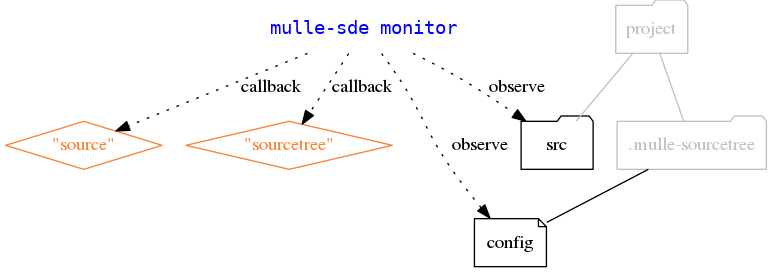
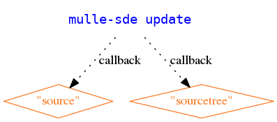

# 🏋🏼 Cross-platform IDE for the command-line

... for Linux, OS X, FreeBSD, Windows

**mulle-sde** is a command-line based software development environment. The
idea is to organize your project with the filesystem, and then let
**mulle-sde** reflect the changed filesystem back to the "Makefile".


**mulle-sde**

* provides a form of package management with [mulle-sourcetree](//github.com/mulle-sde/mulle-sourcetree)
* can build your project with [mulle-craft](//github.com/mulle-sde/mulle-craft) or some other buildtool
* monitors filesystem changes via [mulle-monitor](//github.com/mulle-sde/mulle-monitor) and updates your project files
* tests your project with [mulle-test](//github.com/mulle-sde/mulle-test) or some other testtool
* creates projects and template files using mulle-sde extensions
* can support various languages and buildtools using mulle-sde extensions
* can switch or upgrade extensions


Executable      | Description
----------------|--------------------------------
`mulle-sde`     | Create projects, add and remove dependencies, monitor filesystem and rebuild and test on demand


> **mulle-sde** strives to be buildtool and language agnostic. Currently there
> are only extensions for C and cmake available.


# Commands

## mulle-sde init

Create a **mulle-sde** project.

As the various tools that comprise **mulle-sde** are configured with
environment variables, `mulle-sde init` will create  a virtual environment
using **mulle-env**, so that various projects can coexist on a filesystem with
minimized interference.

> For the followinge example you need to install the following extension:
> [mulle-sde-cmake-c](//github.com/mulle-sde/mulle-sde-cmake)


Enable bash completion:

```
$ . `mulle-sde bash-completion`
```

This is an example, that creates a cmake project for C (this is the default):

```
$ mulle-sde init -d hello -m mulle-sde/cmake-c executable
```

Enter the environment:

```
$ mulle-sde hello
```

Build it:

```
$ mulle-sde craft
```

Run it:

```
$ ./build/hello
```

Monitor the filesystem for new, deleted or modified source files. Then update
some of your source or project files. **mulle-sde** will rebuild your project
automatically:

```
$ mulle-sde monitor
```

Leave the environment:

```
$ exit
```


## mulle-sde craft


Builds your project including all dependencies.


```
mulle-sde craft
```


## mulle-sde dependency


*Dependencies* are typically GitHub projects, that provide a library (like zlib)
or headers. These will be downloaded, unpacked and built into `dependencies`
with the next build:

```
mulle-sde dependency add https://github.com/madler/zlib/archive/v1.2.11.tar.gz
```

See the [mulle-sde Wiki](https://github.com/mulle-sde/mulle-sde/wiki) for more
information about dependencies.


## mulle-sde environment


*Environment* variables are the setting mechanism of **mulle-sde**. They are
handled by [mulle-env](/mulle-sde/mulle-env). These settings can vary,
depending on operating system, host or user.

You can add or remove environment variables with  *environment*.

```
mulle-sde environment list
```


## mulle-sde extension

*Extensions* add support for build systems, language runtimes and other tools
to mulle-sde. *Extensions* are used during *init* to setup a project. A
project, setup with a hypothetically "spellcheck" mulle-sde extension, might
look like this:


There is a *patternfile* `00-text-all` to classify interesting files to
spellcheck. There is a *callback* `text-callback` that gets activated via this
*patternfile* that will schedule the *task* `aspell-task.sh`. The
extension also installs a template file `demo.txt` to get things going quickly.

*mulle-sde* knows about five different extension types

Extensiontype  | Description
---------------|-------------------------------------
buildtool      | Support for build environment and tools like **cmake** .
extra          | Support for extra features like **git**
meta           | A wrapper for extensions (usually buildtool+runtime+extra)
runtime        | Support for language/runtime combinations like C with X11

The builtin support is:

Extensiontype  | Vendor    | Name      | Description
---------------|-----------|-----------|--------------------------
buildtool      | mulle-sde | sde       | Provides the executable `create-build-motd` and some *patternfiles* for working with mulle-sourcetree. It also provides a default README.md file.
runtime        | mulle-sde | extension | An extension to write mulle-sde extensions.


Use *list* to see the *extensions* available:

```
mulle-sde extension list
```

Use *usage* to see special notes for a certain *extensions*:


```
mulle-sde extension usage mulle-sde/extension
```

*upgrade* is the mechanism to install newer or different versions of your
choice of *extensions*

```
mulle-sde extension upgrade
```


See the [mulle-sde Wiki](https://github.com/mulle-sde/mulle-sde/wiki) for more
information about adding and writing extensions.


## mulle-sde library


Libraries are operating system provided libraries (like `libm.a`) that you
don't want to build yourself as a dependency.

```
mulle-sde library add m
```

See the [mulle-sde Wiki](https://github.com/mulle-sde/mulle-sde/wiki) for more
information about managing libraries.


## mulle-sde monitor

Conceptually, *monitor* waits on changes to the filesystem and then calls the
appropriate callback (see below) to rebuild and retest your project.




Environment       | Default        | Description
------------------|----------------|--------------------
`MULLE_SDE_CRAFT` | `mulle-craft`  | Build tool to invoke
`MULLE_SDE_TEST`  | `mulle-test`   | Test tool to invoke

> Resist the itch to replace `mulle-craft` with **make** or some other tool.
> Rather write a *buildtool* extension to create Makefiles and write a
> **mulle-craft** plugin to let it deal with Makefiles.

The monitor is a complex beast and has its own
[project page](https://github.com/mulle-sde/mulle-monitor) and
[Wiki](https://github.com/mulle-sde/mulle-monitor/wiki).


## mulle-sde tool


*Tools* are the commandline tools available in the virtual environment
provided by [mulle-env](/mulle-sde/mulle-env).
You can add or remove tools with this command set.

> This is only applicable to environment styles `-restricted` and `-tight`.
> The `-inherit` style uses the default **PATH**.

```
mulle-sde tool add nroff
```


## mulle-sde update

An *update* reflects changes made in the filesystem back into the buildsystem
"Makefiles". **mulle-sde** executes the task returned by the *callbacks*
`source` and `sourcetree`. The actual work is done by *tasks* of the chosen
*extensions*.



