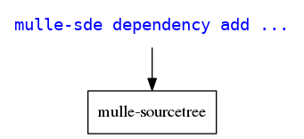
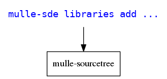
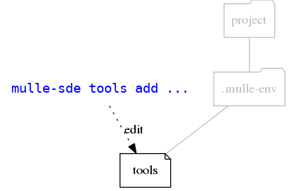

🏋🏼 Cross-platform IDE for the C language family

... for Linux, OS X, FreeBSD, Windows

**mulle-sde** is a commandline based software development environment. The idea is to organize your project with the filesystem, and then let **mulle-sde** reflect the changed filesystem back to the "Makefile".

* creates projects
* can build your project via **mulle-craft** or some other buildtool
* tests your project via **mulle-test** or some other testtool
* adds and removes dependencies via **mulle-sourcetree** 
* monitors filesystem changes and updates your project files


Executable      | Description
----------------|--------------------------------
`mulle-sde`     | Create projects, add and remove dependencies, monitor filesystem and rebuild and test on demand


## Create a **mulle-sde** "hello world" project

A **mulle-sde** project is a (currently) a **cmake** project. Since the
various tools are configured with environment variables, it creates  a virtual environment using **mulle-env**, so that various projects
can coexist.

Create a tool cmake project for C:

```
$ mulle-sde init -d hello executable
```

Enter the environment:

```
$ mulle-sde hello
```

Build it:

```
$ mulle-sde craft
```

Run it:

```
$ ./build/hello
```

Monitor the filesystem for new, deleted or modified source files. Then update project files and rebuild or retest:

```
$ mulle-sde monitor
```

Leave the environment:

```
$ exit
```

## mulle-sde dependencies



## mulle-sde extensions

Extensions are the build systems supported by mulle-sde.

## mulle-sde libraries



Libraries are OS provide libraries (like libm.a) that you don't want to build yourself as a dependency.

## mulle-sde tools



Tools are the commandline tools available in the virtual environment provided by [mulle-env](/mulle-sde/mulle-env).
You can add or remove tools with this command set.

## mulle-sde update

Reflect changes in the filesystem back into the 'Makefiles'. In the case of `cmake` this will create four files `_CMakeHeaders.txt`, `_CMakeSources.txt`, `_CMakeDependencies.txt`, `_CMakeLibraries.txt`. 


Environment                        | Default                  | Description
-----------------------------------|--------------------------|--------------------
`MULLE_SDE_DID_UPDATE_SRC`         | `did-update-src`         | Invoked, when a change to sourcefiles has been detected. 
`MULLE_SDE_DID_UPDATE_SOURCETREE`  | `did-update-sourcetree`  | Invoked, when a change to a `./mulle-sourcetree/config` has been detected.
`MULLE_SDE_IS_HEADER_OR_SOURCE`    | `is-header-or-source"`   | Determines by filename if a file is a source file
`MULLE_SDE_IS_TEST_FILE`           | `is-test-file`           | Determines by filename if a file is a test file


## mulle-sde monitor


The monitor waits on changes to the filesystem and then calls update to rebuild and retest your project. 


Environment       | Default        | Description
------------------|----------------|--------------------
`MULLE_SDE_CRAFT` | `mulle-craft`  | Build tool to invoke
`MULLE_SDE_TEST`  | `mulle-test`   | Test tool to invoke
