# mulle-sde

💠 Cross-platform IDE for the command-line


... for Linux, OS X, FreeBSD, Windows

**mulle-sde** is a command-line based software development environment.
Organize your project in the filesystem, and then let
mulle-sde reflect the changed filesystem back to the "Makefile".
An important aspect of a mulle-sde project is, that your project
can still be built without mulle-sde being installed.

As mulle-sde is a bunch of scripts, a positive side effect is, that
it is inherently scriptable. See the
[mulle-sde Wiki](https://github.com/mulle-sde/mulle-sde/wiki) for
a more indepth introduction on what **mulle-sde** is.

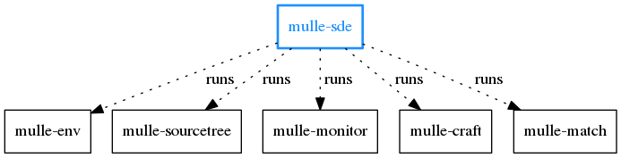

Executable      | Description
----------------|--------------------------------
`mulle-sde`     | Create projects, add and remove dependencies, monitor filesystem and rebuild and test on demand


## Install

See [mulle-sde-developer](//github.com/mulle-sde/mulle-sde-developer) how
to install mulle-sde.

## Documentation

There is quite a bit of documentation in the [mulle-sde WiKi](//github.com/mulle-sde/mulle-sde/wiki).


# Commands


## mulle-sde init

Create a mulle-sde project.

As the various tools that comprise mulle-sde are configured with
environment variables, `mulle-sde init` will create  a virtual environment
using [mulle-env](//github.com/mulle-sde/mulle-env), so that various projects
can coexist on a filesystem with minimized interference.

This is an example, that creates a cmake project for C (this is the default):

```
$ mulle-sde init -d hello -m mulle-sde/c-developer executable
```

Enter the environment:

```
$ mulle-sde hello
```

Optionally look at the project configuration:

```
$ mulle-sde list
```

Build it:

```
$ mulle-sde craft
```

Run it:

```
$ ./kitchen/Debug/hello
```

Update your source or project files manually. Then let mulle-sde reflect your
changes back into the Makefiles and build again:

```
$ mulle-sde reflect
$ mulle-sde craft

```

Or add a template generated source file with reflection for free:

```
$ mulle-sde add src/foo.c
```

Leave the environment:

```
$ exit
```

## mulle-sde add


You can create a templated source file for installed languages with
the `add` command. These files can be optionally pre-loaded with
personalized copyright statements and so forth.

```
mulle-sde add src/Foo.m
```

This command will automatically run `reflect`.

The `add` command can be run outside of an existing mulle-sde environment.


## mulle-sde craft

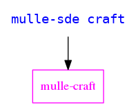

Builds your project including all dependencies.


```
mulle-sde craft
```

## mulle-sde dependency

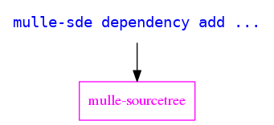

*Dependencies* are typically GitHub projects, that provide a library (like zlib)
or headers only. These will be downloaded, unpacked and built into `dependency`
with the next build:

```
mulle-sde dependency add https://github.com/madler/zlib/archive/v1.2.11.tar.gz
```

You can also embed dependencies in your project, if you want to build them within your project.
*Dependencies* can have nested *dependencies*. mulle-sde will resolve them all
and build them in the appropriate order.

This the most powerful aspect of mulle-sde. See the
[mulle-sde Wiki](https://github.com/mulle-sde/mulle-sde/wiki) for more
information about dependencies.


## mulle-sde environment

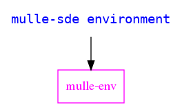

*Environment* variables are the setting mechanism of **mulle-sde**. They are
handled by [mulle-env](/mulle-sde/mulle-env). These settings can vary,
depending on operating system, host or user.

You can add or remove environment variables with *environment*.

```
mulle-sde environment list
```

```
mulle-sde environment set FOO "my foo value"
```

## mulle-sde extension

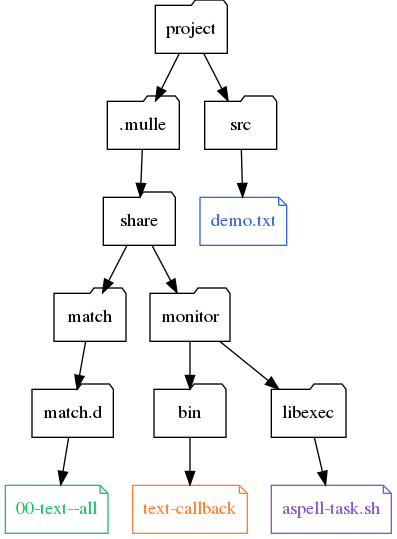

*Extensions* add support for build systems, language runtimes and other tools
like editors and IDEs to mulle-sde. *Extensions* are used during *init* to
setup a project, but can also be added at a later date.

*mulle-sde* knows about five different extension types

Extensiontype  | Description
---------------|-------------------------------------
buildtool      | Support for build environment and tools like **cmake** .
extra          | Support for extra features like **git**.
meta           | A wrapper for extensions (usually buildtool+runtime+extra).
oneshot        | A special kind of extra extension, that can be installed multiple times but is not upgradable. Used primarily for source files.
runtime        | Support for language/runtime combinations like C or Objective-C.

Extensions are installable plugins. The package [mulle-sde-developer](//github.com/mulle-sde/mulle-sde-developer)
provides the basic set of extension. Use *list* to see the *extensions* installed on your system:

```
mulle-sde extension list
```

Use *usage* to see special notes for a certain *extension*:


```
mulle-sde extension usage mulle-sde/extension
```

*upgrade* is the mechanism to install newer or different versions of your
choice of *extensions*:

```
mulle-sde extension upgrade
```

See the [mulle-sde Wiki](https://github.com/mulle-sde/mulle-sde/wiki) for more
information about adding and writing extensions.


## mulle-sde list

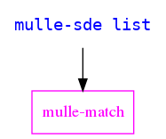

List environment variables, definitions, files and dependencies that comprise
your project:

```
mulle-sde list
```

To see only the project files use:

```
mulle-sde list --files
```

See [mulle-match](https://github.com/mulle-sde/mulle-match) for more
information on this command.


## mulle-sde library

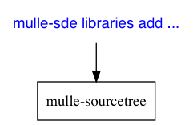

Libraries are operating system provided libraries (like `libm.a`) that you
don't build yourself.

```
mulle-sde library add m
```

You can exclude libraries on a per-platform level (as you can dependencies)

```
mulle-sde library mark m no-os-windows
```

See the [mulle-sde Wiki](https://github.com/mulle-sde/mulle-sde/wiki) for more
information about managing libraries.


## mulle-sde log

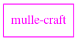

List and inspect log files produced by craft.

```
mulle-sde log list
mulle-sde log cat
mulle-sde log -p "MulleObjC" grep 'foo'
```

## mulle-sde patternfile

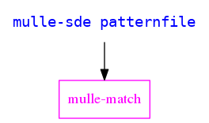

Manage the *patternfiles* that are used by `mulle-sde list` to classify the
files inside your project:

```
mulle-sde patternfile list
```

See [mulle-match](https://github.com/mulle-sde/mulle-match) for more
information on this command.


## mulle-sde status

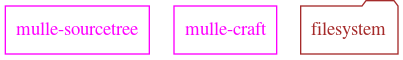

Get a quick description about the state of the mulle-sde project.

```
mulle-sde status
```


## mulle-sde tool

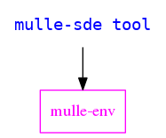

*Tools* are the commandline tools available in the virtual environment
provided by [mulle-env](/mulle-sde/mulle-env).
You can add or remove tools with this command set.

> This is only applicable to environment styles `restricted` and `tight`.
> The `inherit` style uses the default **PATH**.

```
mulle-sde tool add nroff
```


## mulle-sde reflect

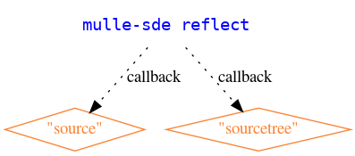

This command **reflects** changes made in the filesystem back into the
build-system "Makefiles". You don't edit them manually, but let them be created
for your.

```
rm src/foo.*
mulle-sde reflect
```

mulle-sde executes the tasks returned by the *callbacks* `source` and
`sourcetree`. The actual work is done by *tasks* of the chosen *extensions*.


## mulle-sde linkorder

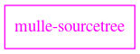

The *linkorder* command outputs clang/gcc-style link commands that you can
use to link your *dependencies* and *libraries* outside of *mulle-sde*:


e.g.

```
mulle-sde linkorder --output-format ld

-Wl,--whole-archive -Wl,--no-as-needed -lMulleObjC -Wl,--as-needed -Wl,--no-whole-archive -ldl -lmulle-container -Wl,--whole-archive -Wl,--no-as-needed -lmulle-objc-runtime -Wl,--as-needed -Wl,--no-whole-archive -lmulle-stacktrace -lmulle-vararg -lmulle-concurrent -lmulle-aba -lmulle-thread -lpthread -lmulle-allocator
```

## Afterword

There are many more commands in mulle-sde. These are the most commonly
used ones.

# Quick Commands

Inside the **mulle-sde** subshell, you have a few aliases defined to save
you typework. These are

Command  | Description
---------|--------------------------------
c        | craft project
C        | clean and craft project
CC       | clean project and dependencies, then craft
t        | run tests that haven't run yet or failed one by one
tt       | craft project, then run tests like 't'
T        | clean and craft project, then run tests in parallel
TT       | clean project and dependencies, then craft, then test
l        | list files and dependencies
r        | reflect project


To have the same functionality without entering the subshell, define these
aliases in your `.bashrc`:

```
alias c="mulle-sde craft"
alias C="mulle-sde clean; mulle-sde craft"
alias CC="mulle-sde clean all; mulle-sde craft"
alias t="mulle-sde test rerun --serial"
alias tt="mulle-sde test craft ; mulle-sde test rerun --serial"
alias T="mulle-sde test craft ; mulle-sde test"
alias TT="mulle-sde test clean all; mulle-sde test"
alias r="mulle-sde reflect"
alias l="mulle-sde list --files"
```
